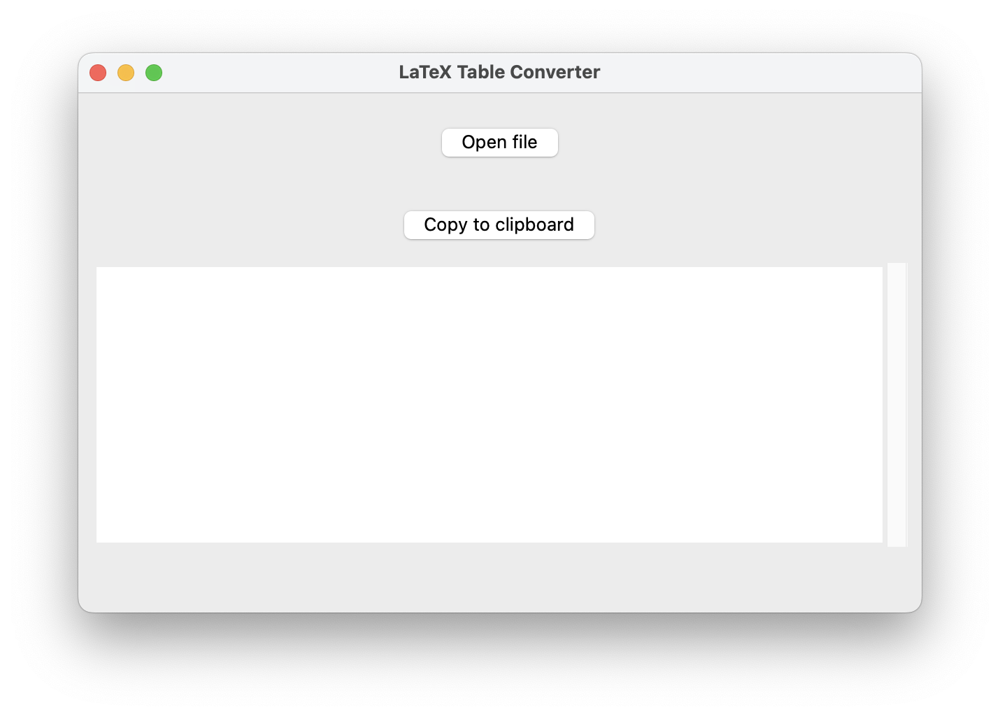
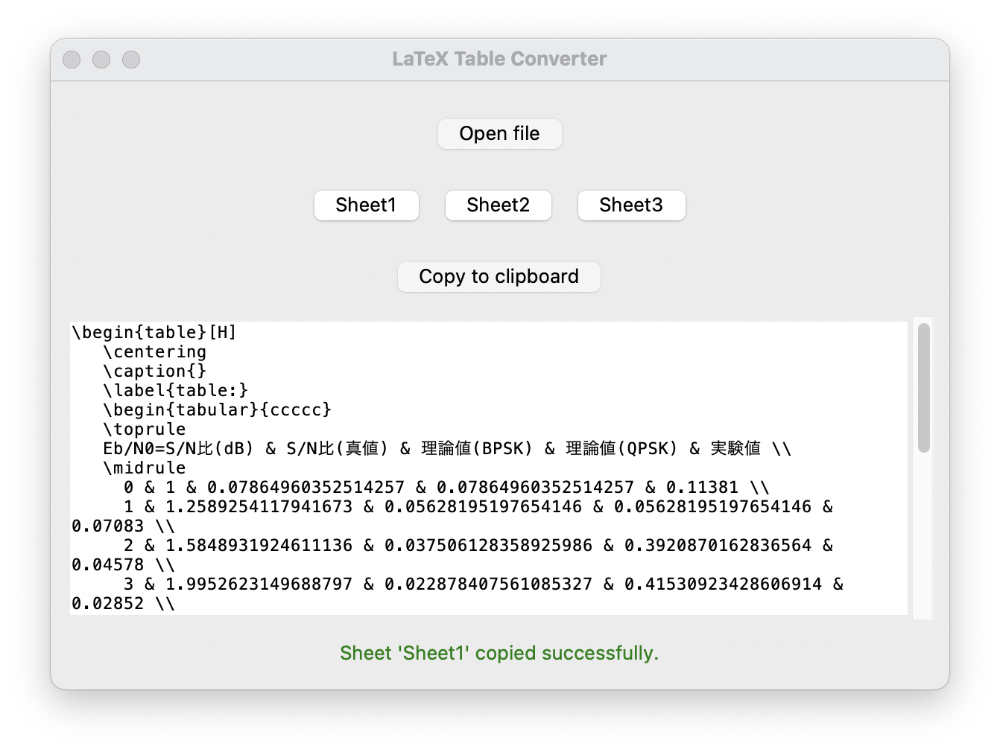

# TexTable <!-- omit in toc -->

- [インストール](#インストール)
  - [ビルド済みのバイナリを使用する場合](#ビルド済みのバイナリを使用する場合)
  - [ソースコードからビルドする場合](#ソースコードからビルドする場合)
    - [依存関係のインストール](#依存関係のインストール)
    - [ビルド](#ビルド)
- [使い方](#使い方)
  - [Mac の場合](#mac-の場合)
  - [Linux の場合](#linux-の場合)

TexTable は、CSV および Excel ファイルを LaTeX の表に変換するためのシンプルなライブラリです。

# インストール

## ビルド済みのバイナリを使用する場合

ビルドされたものは[releases](https://github.com/tetsugo02/TexTable/releases)を参照してください。

## ソースコードからビルドする場合

### 依存関係のインストール

`requirements_Mac.txt`または`requirement_Linux.txt`を使用して、依存関係をインストールします。

```sh
# Macの場合
pip install -r  requirements_Mac.txt

# Linuxの場合
pip install -r  requirements_Linux.txt
```

### ビルド

[`build.py`](./build.py)を実行してください。

```sh
python build.py
```

# 使い方

## Mac の場合

ビルドされた`TexTable`をクリックして起動します。すると、以下のようなウィンドウが表示されます。

`Open File`ボタンをクリックして、.xlsx または.csv ファイルを選択します。選択すると、ワークシートが変換され、LaTeX の表が表示されます。同時に、<b>クリップボードに自動的にコピーされます。</b>

xlsx ファイルの場合、work sheet を選択することができます。


## Linux の場合

ビルドされた`TexTable`をターミナルから起動します。

```sh
./TexTable.bin
```
